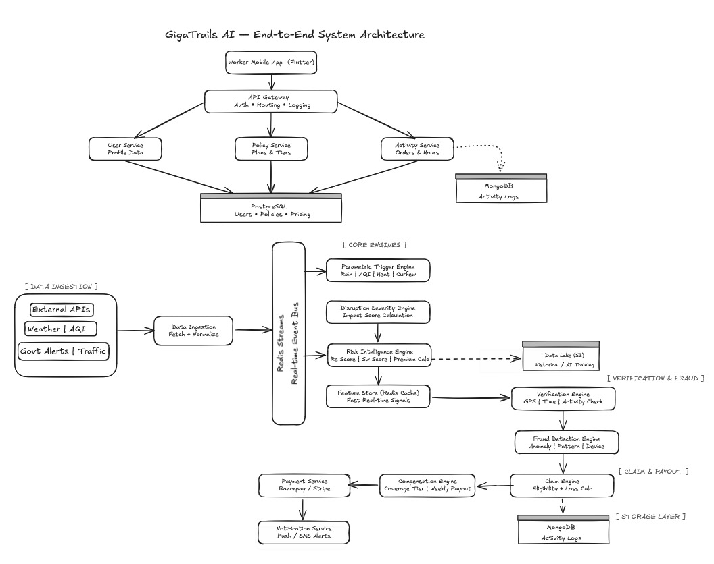
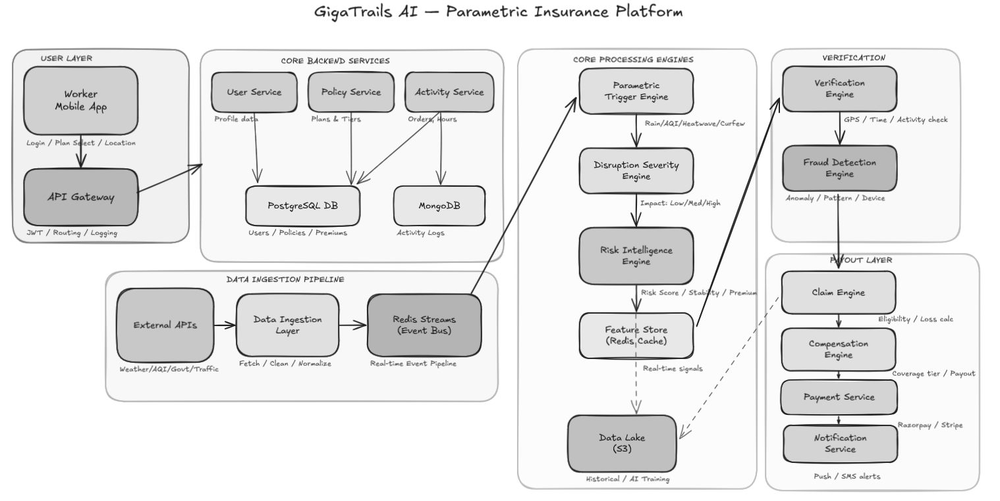
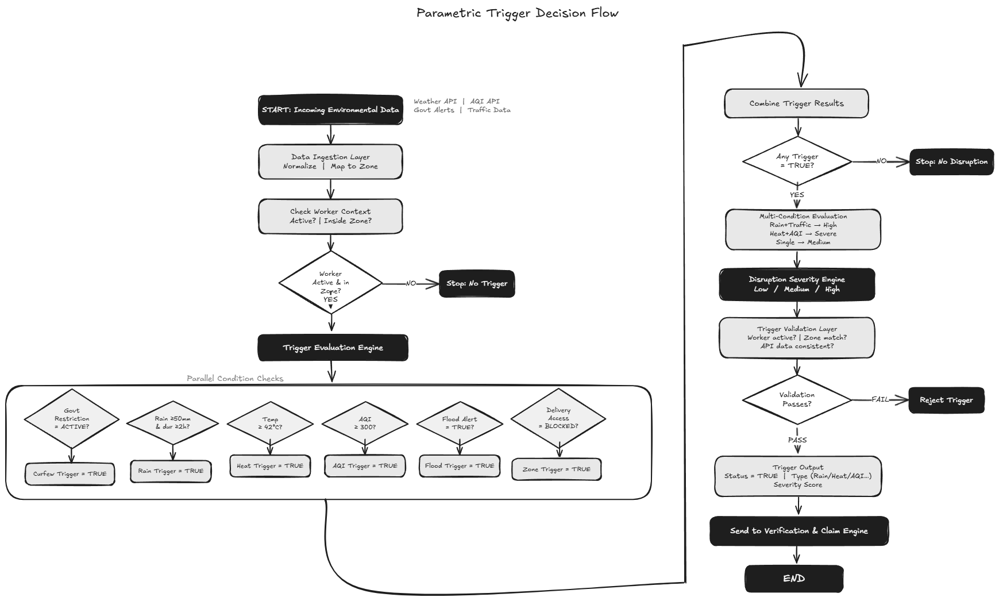

# **GigaTrails AI – Parametric Insurance for Gig Delivery Workers**

## What is GigaTrails?

**GigaTrails AI** is a smart parametric insurance platform built for gig delivery workers (Swiggy, Zomato, Blinkit, Zepto).  
It protects weekly income by automatically detecting real-world disruptions like heavy rain, floods, heatwaves, poor air quality, or local restrictions and triggering payouts without manual claim filing.

GigaTrails combines:

- real-time environmental monitoring
- AI-based risk scoring
- zone-level verification
- automated compensation

The goal is simple: **give delivery workers a reliable financial safety net when disruptions reduce their ability to work.**

## Table of Contents

- [Overview](#overview)
- [Problem Statement](#problem-statement)
- [Target Persona](#target-persona)
- [Solution Approach](#solution-approach)
- [Weekly Premium Model & Pricing Intelligence](#weekly-premium-model--pricing-intelligence)
- [Parametric Triggers](#parametric-triggers)
- [AI and Machine Learning Integration](#ai-and-machine-learning-integration)
- [Platform Choice](#platform-choice)
- [User Experience Design](#user-experience-design)
- [Technology Stack](#technology-stack)
- [System Architecture](#system-architecture)
- [Development Plan](#development-plan)
- [Innovation Highlights](#innovation-highlights)

## Overview

**GigaTrails AI** is an AI-powered parametric insurance platform designed to protect gig economy delivery workers from income loss caused by environmental or social disruptions.

Food delivery riders rely heavily on daily working hours to maintain their weekly earnings. However, external disruptions such as heavy rainfall, extreme heat, severe air pollution, or local restrictions can significantly reduce their ability to work.

GigaTrails AI provides an automated financial safety net that detects disruptions using real-world environmental data and automatically compensates workers for lost income.

Unlike traditional insurance systems that require manual claim submission and verification, GigaTrails AI follows a **parametric insurance model** where predefined environmental conditions automatically trigger payouts.

The system strictly focuses on **income protection for delivery workers** and excludes coverage for health, accidents, or vehicle repairs.

---

## Problem Statement

Food delivery riders working for digital platforms depend on consistent working hours to earn income.

However, multiple uncontrollable factors can disrupt their work, including:

- Heavy rainfall
- Flooding
- Heatwaves
- Severe air pollution
- Local curfews or zone restrictions

These disruptions can reduce working hours and cause a **20–30% loss in weekly earnings**.

Currently, gig workers have **no automated protection against these disruptions**, leaving them financially vulnerable.

GigaTrails AI addresses this challenge by creating a **data-driven parametric insurance platform** that automatically detects disruptions and compensates workers for lost income.

---

## Target Persona

### Food Delivery Riders

Platforms:

- Swiggy
- Zomato
- Blinkit
- Zepto

#### Characteristics

- Income depends on number of deliveries completed
- Works outdoors for long hours
- Highly impacted by environmental disruptions
- Uses smartphones for navigation and order management
- Requires simple and fast mobile interfaces

---

#### Example Scenario

Ananya is a delivery rider working with **Zomato in Hyderabad**.

On a high-demand evening, **intense rainfall causes waterlogging across key delivery routes and multiple restaurant partners pause operations**.

As a result, Ananya is unable to complete enough orders and faces a noticeable drop in weekly income.

With **GigaTrails AI**, the platform detects the disruption in Ananya's delivery zone, validates the event using weather feeds, location signals, and delivery activity patterns, and estimates her protected income loss.

The compensation is then **automatically credited to her weekly payout**, with no manual claim process required.

---

## Solution Approach

GigaTrails AI is built using a **four-layer intelligent system architecture** that combines risk modeling, real-time monitoring, multi-factor verification, and automated compensation.

This layered design ensures scalability, real-time responsiveness, and fraud-resistant insurance processing.

## System Architecture



---

## Architecture Explanation

The GigaTrails AI system follows a **modular, event-driven architecture** that enables real-time disruption detection, intelligent pricing, and automated insurance payouts.

### Key Flow Summary

- The **mobile application** interacts with backend services through an API Gateway for authentication, routing, and data exchange.
- External environmental data (weather, AQI, alerts) is continuously ingested and processed through a **real-time event pipeline (Redis Streams)**.
- The **Parametric Trigger Engine** detects disruption events, which are further evaluated by the **Disruption Severity Engine** to measure impact.
- The **Risk Intelligence Engine** computes environmental risk (Rₑ), worker stability (S_w), and dynamically calculates premiums.
- The **Verification and Fraud Detection layers** ensure that only valid and genuine claims are processed.
- The **Claim and Compensation Engines** calculate income loss and determine payouts based on coverage tiers.
- Finally, the **Payment Service** processes payouts and the **Notification Service** informs the user in real time.

### Design Highlights

- **Event-driven processing** ensures low-latency and real-time responsiveness
- **Micro-zone risk intelligence** enables personalized pricing
- **Multi-layer fraud detection** improves reliability and trust
- **Scalable modular design** allows easy expansion across cities and platforms

This architecture ensures that the system is **efficient, scalable, and capable of fully automated parametric insurance processing**.

---

### 1. Risk Intelligence Layer (Core Decision Engine)

This layer is responsible for **risk modeling and pricing intelligence** at a micro-zone level.

It combines environmental data and worker behavior to compute personalized insurance premiums.

#### Inputs

- historical rainfall patterns
- temperature and heatwave trends
- air quality index (AQI)
- disruption frequency (floods, curfews)
- delivery demand density
- worker activity patterns

#### Processing

- Compute **Environmental Risk Score (Rₑ)**
- Compute **Worker Stability Score (S_w)**
- Apply **Hybrid Pricing Model**

#### Pricing Engine

The weekly premium is calculated as:

```math
P = B × (1 + αRₑ) × Cₜ × (1 − βS_w)
```

#### Output

- dynamic weekly premium
- zone-level risk classification
- disruption probability score

---

### 2. Disruption Monitoring Layer (Real-Time Trigger Engine)

This layer continuously monitors real-time external data streams to detect disruption events.

#### Data Sources

- Weather APIs (rainfall, temperature)

- AQI APIs (pollution levels)

- Government alerts (curfews, restrictions)

- Traffic/mobility indicators (optional)

#### Trigger Logic

```text
IF rainfall > threshold AND duration > threshold
AND worker is active in zone
THEN trigger = TRUE
```

#### Advanced Triggering

- multi-condition triggers (rain + traffic slowdown)

- time-aware triggers (peak-hour disruption impact)

- zone-specific thresholds

#### Output

- trigger event (TRUE / FALSE)

- disruption severity score

---

### 3. Smart Verification Layer (Fraud Control System)

- This layer ensures that all claims are valid, accurate, and fraud-resistant using multi-signal verification.

#### Verification Signals

1. GPS Geo-Fencing

- verifies worker presence in affected zone

- detects GPS spoofing and mismatches

2. Activity Drop Detection

- compares delivery activity before and during disruption

- identifies abnormal drop patterns

3. Time Correlation Check

- validates disruption timing against worker’s active hours

4. Camera-Based Validation (Optional)

- worker uploads real-time image

  computer vision model detects:
  - heavy rain

  - flooding

  - low visibility conditions

5. Environmental Cross-Validation

- verifies API data consistency with actual disruption

#### Output

- verified claim score (0–1)

- fraud risk flag

---

### 4. Automated Compensation Layer (Payout Engine)

This layer calculates and processes income protection payouts.

#### Inputs

- worker average hourly earnings

- disruption duration

- activity reduction percentage

- coverage tier (Cₜ)

#### Compensation Logic

```text
Compensation = Earnings × Loss Fraction × Coverage Factor
```

Where:

- Loss Fraction = reduction in working hours or orders

- Coverage Factor = based on selected tier

#### Features

- weekly payout aggregation

- instant payout simulation (Phase 3)

- tier-based compensation adjustment

#### Output

- final payout amount

- credited to worker’s weekly earnings

---

## User Flow

The GigaTrails AI user flow is designed to be simple, automated, and seamless for delivery workers.



1. The worker logs into the mobile app and selects an insurance plan (Basic, Standard, or Premium).
2. The system continuously tracks the worker’s location and activity during working hours.
3. External data sources (weather, AQI, government alerts) are monitored in real time.
4. When a disruption occurs, the system automatically detects it using parametric triggers.
5. The event is verified using GPS, activity data, and environmental signals.
6. The system calculates income loss and applies the selected coverage tier.
7. Compensation is automatically processed and credited to the worker’s account.
8. The worker receives a real-time notification about the payout.

This flow ensures a **fully automated, zero-claim insurance experience** for gig workers.

---

## Weekly Premium Model & Pricing Intelligence

GigaTrails AI follows a **Hybrid Risk-Behavior Pricing Model** designed to dynamically calculate weekly insurance premiums based on environmental conditions, worker activity, and selected coverage level.

Unlike static pricing systems, this model ensures that premiums are:

- responsive to real-world disruptions
- personalized to each worker
- fair and sustainable

---

### Policy Tiers

GigaTrails AI provides three flexible coverage tiers:

| Tier     | Coverage Scope                     | Protection | Factor (Cₜ) |
| -------- | ---------------------------------- | ---------- | ----------- |
| Basic    | Rain, Heatwave, Flood              | 40%        | 0.4         |
| Standard | Basic + Air Quality disruptions    | 60%        | 0.6         |
| Premium  | Standard + Government restrictions | 80%        | 0.8         |

---

### Core Pricing Formula

```math
P = B × (1 + αRₑ) × Cₜ × (1 − βS_w)
```

---

### Variable Definitions

| Variable | Description                       |
| -------- | --------------------------------- |
| **P**    | Final weekly premium              |
| **B**    | Base premium (minimum fixed cost) |
| **Rₑ**   | Environmental risk score (0 to 1) |
| **Cₜ**   | Coverage tier factor              |
| **S_w**  | Worker stability score (0 to 1)   |
| **α**    | Risk sensitivity coefficient      |
| **β**    | Stability reward coefficient      |

---

### Environmental Risk Score (Rₑ)

The environmental risk score represents the likelihood of disruptions in the worker’s delivery zone.

It is computed using real-time and historical data from:

- rainfall intensity
- temperature (heatwave conditions)
- air quality index (AQI)

#### Risk Calculation

```math
Rₑ = 0.4 × Rain Risk + 0.3 × Heat Risk + 0.3 × AQI Risk
```

Each component is normalized between **0 and 1**.

#### Update Frequency

- Updated every few hours using API data
- Aggregated weekly for pricing

---

### Worker Stability Score (S_w)

This score represents how consistent and active a worker is.

It is calculated based on:

- number of active working days
- average working hours
- delivery completion consistency

#### Stability Calculation

```math
S_w = 0.5 × Consistency + 0.3 × Activity + 0.2 × Engagement
```

#### Behavior Impact

- High stability → lower premium
- Low stability → higher premium

---

### Variable Update Mechanism

The pricing model variables in GigaTrails AI are dynamically updated using real-time data, worker activity, and system controls.

| Variable                          | Description                               | Data Source                           | Frequency                            | Update Method                                                 |
| --------------------------------- | ----------------------------------------- | ------------------------------------- | ------------------------------------ | ------------------------------------------------------------- |
| **Rₑ** (Environmental Risk Score) | Measures disruption risk in worker's zone | Weather API, AQI API, historical data | Every 3–6 hours (weekly aggregation) | Calculated using normalized rain, heat, and AQI components    |
| **S_w** (Worker Stability Score)  | Measures worker consistency and activity  | App usage, delivery activity logs     | Daily/Weekly                         | Computed from active days, working hours, and completion rate |
| **Cₜ** (Coverage Tier Factor)     | Determines protection level               | User input (app selection)            | On user change                       | Fixed values: Basic (0.4), Standard (0.6), Premium (0.8)      |
| **B** (Base Premium)              | Minimum base cost of insurance            | System configuration                  | Rarely updated                       | Platform-defined baseline value                               |
| **α** (Risk Sensitivity)          | Controls environmental risk impact        | System configuration                  | Rarely updated                       | Admin tuned based on risk trends                              |
| **β** (Stability Reward)          | Controls stability-based discount         | System configuration                  | Rarely updated                       | Adjusted to balance fairness and incentives                   |
| **P** (Final Premium)             | Weekly insurance premium                  | Derived from all variables            | Weekly                               | Computed via pricing formula with smoothing and constraints   |

---

### Premium Calculation Flow

```text
1. Fetch environmental data (weather, AQI)
2. Compute environmental risk score (Rₑ)
3. Collect worker activity data
4. Compute stability score (S_w)
5. Get selected coverage tier (Cₜ)
6. Apply pricing formula
7. Apply constraints and smoothing
8. Generate final weekly premium
```

---

### Example Calculation

Given:

- Base premium (B) = ₹20
- Environmental risk (Rₑ) = 0.5
- Tier = Standard → Cₜ = 0.6
- Stability score (S_w) = 0.7
- α = 0.8
- β = 0.3

```math
P = 20 × (1 + 0.8 × 0.5) × 0.6 × (1 − 0.3 × 0.7)
```

Final Premium ≈ **₹26 – ₹32 per week**

---

### Pricing Constraints

#### Minimum Premium

```text
≥ ₹15
```

#### Maximum Weekly Increase

```text
≤ 25% increase compared to previous week
```

---

### Premium Smoothing

To avoid sudden fluctuations:

```math
Final Premium = 0.7 × Previous + 0.3 × New
```

---

### Zone-Based Pricing

Premiums are calculated at a **micro-zone level**, not just city level.

Examples:

- High flood-prone zones → higher premium
- Low-risk areas → lower premium

---

### External APIs & Data Sources

| API / Source                      | Data Provided                                   | Role in System                                                       | Link                               |
| --------------------------------- | ----------------------------------------------- | -------------------------------------------------------------------- | ---------------------------------- |
| OpenWeather API                   | Rainfall, temperature, weather conditions       | Real-time environmental trigger detection and risk score calculation | https://openweathermap.org         |
| OpenAQ API                        | Air Quality Index (AQI) levels                  | AQI-based triggers and environmental risk modeling                   | https://docs.openaq.org            |
| Google Maps API                   | Traffic data, route delays, road conditions     | Multi-condition triggers and disruption severity estimation          | https://developers.google.com/maps |
| Government Alert Systems (NDMA)   | Curfew, restriction, emergency alerts           | Social triggers (zone shutdown, restrictions)                        | https://ndma.gov.in                |
| Open Government Data (data.gov)   | Regional datasets, zone-level information       | Zone validation and disruption confirmation                          | https://data.gov.in                |
| Flood Monitoring (FFS)            | River levels, flood alerts                      | Flood trigger validation and high-risk detection                     | https://ffs.india-water.gov.in     |
| Satellite Weather (MOSDAC - ISRO) | Satellite weather, flood monitoring             | Advanced environmental validation and accuracy improvement           | https://mosdac.gov.in              |
| Platform APIs (Simulated)         | Delivery demand, zone closures, worker activity | Activity drop detection and trigger validation                       | Simulated                          |

---

## Parametric Triggers

Parametric triggers define the predefined conditions under which insurance coverage is automatically activated.

Instead of manual claim requests, GigaTrails AI uses a real-time, rule-based trigger engine that continuously evaluates environmental and system signals to detect disruptions.

## 

---

## AI and Machine Learning Integration

GigaTrails AI uses machine learning in a **focused and practical manner** to improve pricing accuracy and ensure fraud-resistant insurance processing.

AI is applied only in critical components where it adds real value, while keeping the rest of the system simple and efficient.

---

### 1. AI-Powered Risk Assessment (Primary Component)

The core use of AI in GigaTrails AI is to compute the **Environmental Risk Score (Rₑ)**, which directly influences the weekly premium.

#### Approach

- Historical environmental data is collected:
  - rainfall patterns
  - temperature trends
  - air quality index (AQI)
  - disruption frequency

- A **Random Forest Regressor** is used to estimate the likelihood of disruptions in a specific delivery zone.

#### Why Random Forest?

- Works well with tabular data
- Handles non-linear relationships
- Requires minimal tuning (ideal for MVP)

#### Output

- Risk Score (Rₑ) between 0 and 1
- Used in the premium calculation model

---

### 2. Fraud Detection (Hybrid Approach)

To prevent invalid claims, GigaTrails AI uses a combination of **rule-based validation and lightweight machine learning**.

#### Rule-Based Checks

- worker must be active during disruption
- GPS location must match delivery zone
- no duplicate claims

#### Machine Learning (Optional Enhancement)

- **Isolation Forest** is used to detect abnormal claim patterns

#### Input Features

- GPS location consistency
- activity logs
- claim frequency
- session/device patterns

#### Output

- Fraud Risk Flag (Low / Medium / High)
- Suspicious claims are blocked or flagged

---

### 3. Disruption Prediction (Optional Enhancement)

The system can optionally use simple predictive logic to improve intelligence.

#### Approach

- Uses weather forecasts and AQI trends
- Applies threshold-based and trend analysis

#### Output

- Early disruption alerts
- Improved risk estimation

---

### AI Design Philosophy

GigaTrails AI follows a **practical AI approach**:

- Use machine learning only where necessary
- Prefer simple, explainable models
- Ensure real-time performance
- Avoid over-complex architectures

---

### AI Summary

| Component          | Method Used              | Purpose                 |
| ------------------ | ------------------------ | ----------------------- |
| Risk Assessment    | Random Forest Regressor  | Dynamic premium pricing |
| Fraud Detection    | Rules + Isolation Forest | Fraud prevention        |
| Disruption Insight | Trend-based logic        | Early alerts (optional) |

---

## This approach ensures that the system is **accurate, scalable, and aligned with real-world insurance requirements**, while remaining efficient for implementation in a hackathon setting.

---

## Technology Stack

## 

---

## Development Plan

### Phase 1 – Research and Planning

- Define user persona
- Analyze disruption patterns
- Design system architecture
- Create workflow documentation
- Build UI prototype

Deliverables include:

- README documentation
- project repository
- strategy demo video

---

### Phase 2 – MVP Development

The minimum viable product will include:

- Worker registration
- Insurance policy management
- Dynamic premium calculation
- Parametric trigger detection
- Automated claim processing

---

### Phase 3 – Advanced Features

The final stage will include:

- AI-based fraud detection
- Instant payout simulation
- Predictive disruption analysis
- Analytics dashboard

---

## Innovation Highlights

GigaTrails AI introduces an automated parametric insurance system specifically designed for gig delivery workers.

Key innovations include:

- AI-driven risk-based premium calculation
- Automated claim settlement without manual intervention
- Real-time environmental disruption monitoring
- Multi-factor verification using GPS, environmental APIs, and optional camera input
- Mobile-first design tailored for gig workers

By combining artificial intelligence, environmental data, and automated insurance logic, GigaTrails AI provides gig workers with a reliable and scalable financial safety net.
